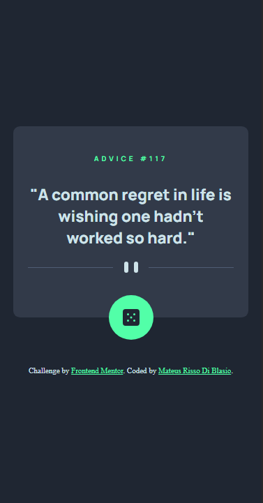
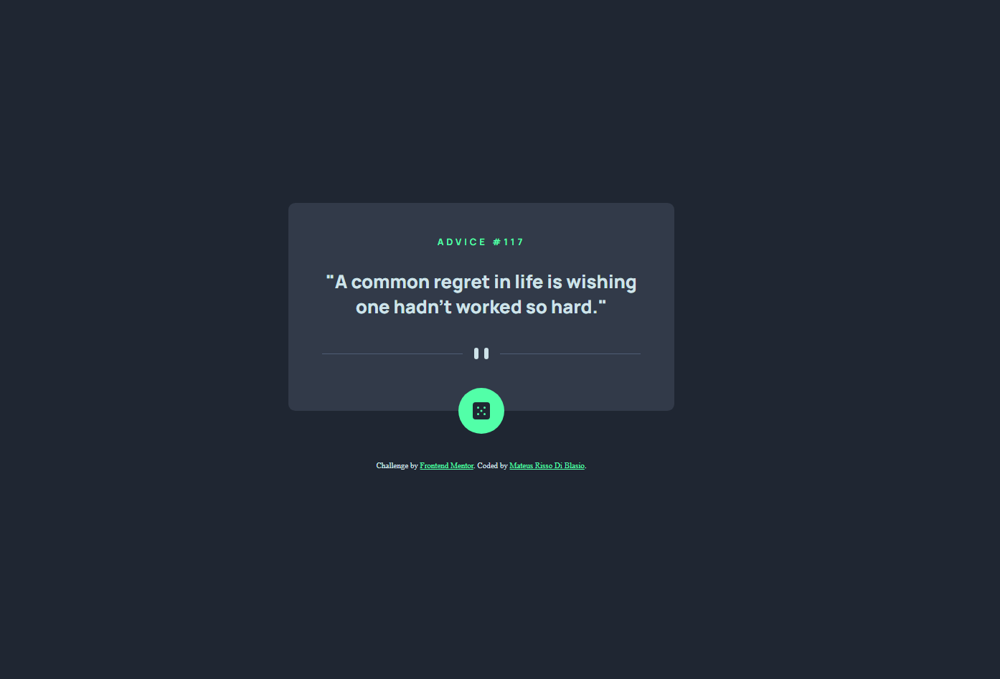

# Frontend Mentor - Advice generator app solution

This is a solution to the [Advice generator app challenge on Frontend Mentor](https://www.frontendmentor.io/challenges/advice-generator-app-QdUG-13db). Frontend Mentor challenges help you improve your coding skills by building realistic projects.

## Table of contents

- [Overview](#overview)
  - [The challenge](#the-challenge)
  - [Screenshot](#screenshot)
  - [Links](#links)
- [My process](#my-process)
  - [Built with](#built-with)
  - [What I learned](#what-i-learned)
  - [Continued development](#continued-development)  
- [Author](#author)

## Overview

### The challenge

Users should be able to:

- View the optimal layout for the app depending on their device's screen size
- See hover states for all interactive elements on the page
- Generate a new piece of advice by clicking the dice icon

### Screenshot

### Links

- Solution URL: [Add solution URL here](https://your-solution-url.com)
- Live Site URL: [https://www.frontendmentor.io/solutions/responsive-advice-generator-app-OM7MLhyb68](https://www.frontendmentor.io/solutions/responsive-advice-generator-app-OM7MLhyb68)

## My process

### Built with

- Semantic HTML5 markup
- CSS custom properties
- Flexbox
- Mobile-first workflow

### What I learned

First approach on a simple API usage.

### Continued development

API tools nowadays are massively used to achieve great workflows allowing instantly responses to users needs. Which brings me to go further on this topic.

## Author

- GitHub - [Mateus Risso Di Blasio](https://github.com/MateusRissoDiBlasio)
- Frontend Mentor - [@MateusRissoDiBlasio](https://www.frontendmentor.io/profile/MateusRissoDiBlasio)
